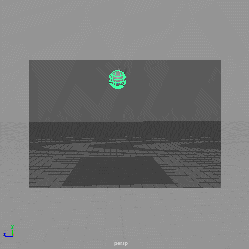
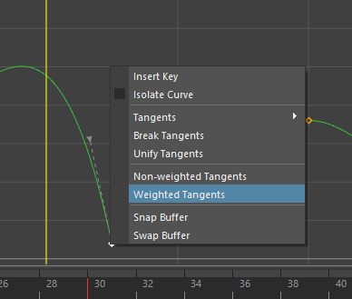
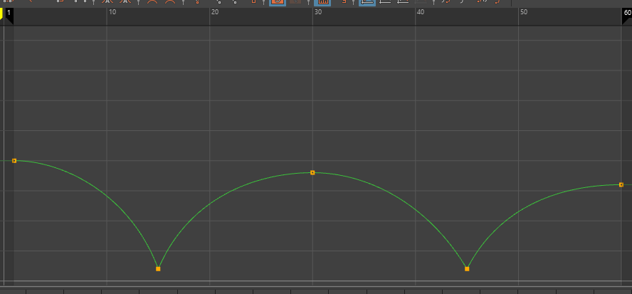
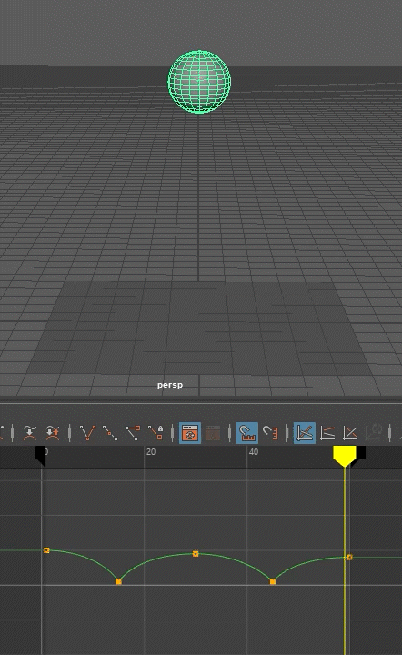
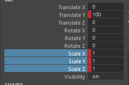
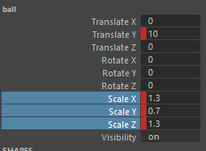
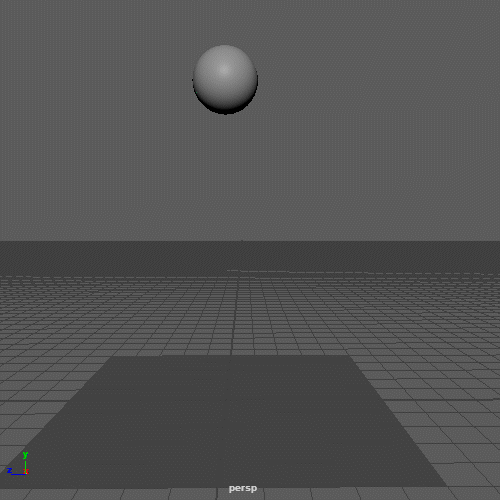

# Animation basics

This worksheet covers the fundamental skills needed to animate.

### Create a new scene

- Open Maya and create a new scene

### Create the ground

- Create a ground plane by **Double clicking** on the polygon Plane button.

- Setting the width an height to 100 and the divisions to 1.

- Lastly, rename it to "ground" in the outliner.

### Create a ball

**Double click** on the polygon sphere button 

- Set the radius to 10 and the divisions to 20

- rename it to "ball" in the outliner.

- Try to give the ball a colour. 
(HINT: With the ball selected right click and choose "Assign new material" )

## Animation workspace

Now that we have set up our scene we can start to animate.

When animating it will be helpful to have access to different panel.

- Change the workspace to Animation in the top right corner of the screen

### Tour of workspace

On the right we have the **channel box** this is where we can keyframe the properties we want to animate.

At the bottom of the screen is the **range slider**, this is where we change the settings for the animation

Above this is the **timeline**, this shows us when we have set keyframes on the selected object.

Finally, we have the graph editor, this  shows how each keyframe transitions to the next.

We will use all these panels in the worksheet.

## Animation settings

We want the animation to run at 30 frames per second (FPS) and be a few seconds long.

- On the **range slider** panel change Change the FPS to 30

- To the left Change the number on the right to 90, this is the total number of frames in our animation ( 3 seconds @ 30fps)

- Move the slider to the far left, and change the right hand number to 60. This shows the range currently viewable in the timeline above.

- Lastly, click on the **time slider preferences** button in the bottom right to open the panel

- Change the playback speed to **30fps x 1** this will ensure the time line plays our animation at the correct speed.

### Create a key frame

Now that we have set the animation settings we can start to animate our ball.

- Click on the far left of the time slider to select the first frame.

- Select the ball and move it to 100 on the y axis. You can do this by using the move tool (w on the keyboard) or typing 100 in the channel box.

-To set a key frame, right click on **Translate y** in the channel box and select **Key selected**

The property should turn red to indicate that it has a key frame, you should also see a red line on the timeline on frame 1.

## Another keyframe

- Now move the playhead on the time slider to frame 15

- Move the ball down so that it is just touching the ground (it may be helpful to go into the side view)

- Keyframe the ball again by right clicking on the Translate Y property in the channel box.

You should now have 2 key frames.

## Set some more keyframes

You can now set the last few keyframes on your own, we want the ball to bounce twice, so set the following:

frame 30, set y to 90
frame 45, set y to 10
frame 60, set y to 80

## Play the animation

You can now play your animation by clicking on the play button to the right of the timeline (shortcut is **alt/option + v**)

It should be animating, but it doesn't really look like its bouncing. Why does it look wrong?

## Graph editor

With the ball selected, hover over the graph editor and press **f** on the keyboard to fill the graph to the screen.

By default Maya creates a smooth transition between keyframes. 

To make the bounce more realistic
we want a sharp change of direction on the bottom where it hits the floor and incease the curve on the top where the ball looses the right against gravity.

- Select the second keyframe on the graph editor so you can see the handles

You can move the handles around to change the shape of the curve, but we want to move them around independently.

- **Right click** on keyframe and select **break keyframes** or press the button on the top right of the panel.

We can now move each handle independently but we also want to change the length so we have full control.

- Right click the keyframe again and choose **weighted tangents**

- You can now alter all the keyframes to create a sharp change in direction at the bottom of the bounce, and a gentle curve at the top.

play the animation again to see the result.

## Squash and  Stretch

This is one of the most important principles in animation.

When an object moves or collides with something it will deform. 

If your object is made of a rubbery or flexible material it will deform more.

We want the ball to stay circular at the top of the bounce.

- Select frame 1, and keyframe Scale X, Scale Y and Scale Z at 1.

- Do the same thing on Frame 30 and 60.

We can now move to frame 15 and squash the ball.

We need to squash it vertically by reducing the scale Y but to conserve the balls volume, this means we also need to stretch it horizontally by increasing Scale X and Scale Z.

You may now see that the ball is above the ground 

- Adjust and key y position and key it again.

- Do the same for the second bounce at frame 45 and then look at your animation.
- 
- Why does it look wrong now? How can we fix it?

## Refine the animation

We have a similar issue as before, Maya is smoothing out the transition between keyframes so the ball starts to squash as it falls.

To fix this we need the ball to remain spherical until just before it hits the ground.

- On frame 14, just before the ball hits the ground, key the scale of the ball to 1.

- Do the same thing on frame 44.

The ball should now stay spherical as it falls, but you may also want to add a keyframe a after the bounce so that is returns to its previous shape quicker. 

- Add a keyframe to frame 18 and 48, keying the balls scale back to 1.

### Final animation

We now have a basic ball animation and you have covered all the basic skills of animating simple object in Maya.

## Final challenge

- Add a keyframes to translate x or translate z to move it sideways as it bounces.
