# Animation basics

This worksheet covers the fundamental skills needed to animate in Maya.

### Create a new scene

- Open Maya and create a new scene

### Create the ground

- Create a ground plane by **Double clicking** on the polygon Plane button to open the polygon plane options panel.

- Set the width and height to 100 and the divisions to 1.

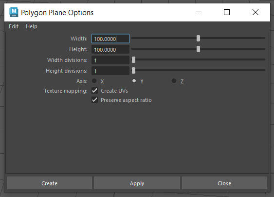

- It is always a good idea to rename things as you go, so rename the new plane to "ground" in the outliner.

### Create a ball

**Double click** on the polygon sphere button to open the options.

- Set the radius to 10 and the divisions to 20.

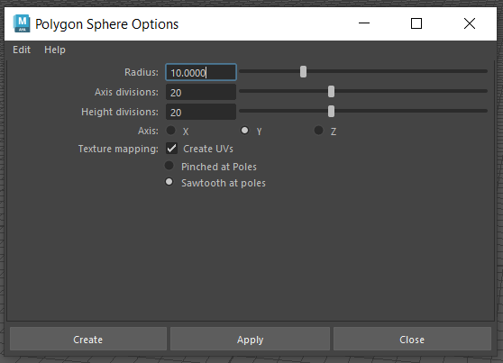

- Rename it to "ball" in the outliner.

### Challenge
 
- Give the ball a colour or a texture. 

Make sure you name the new texture appropriately and you can see it in the ball.

(HINT: With the ball selected right click and choose "Assign new material" )

Please ask for help if you are unable to complete this challenge.

## Animation workspace

When animating it will be helpful to have access to different panel.

- Change the workspace to Animation in the top right corner of the screen

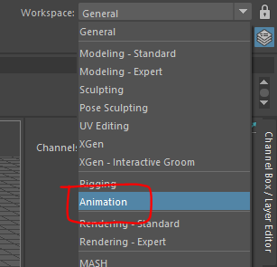

### Tour of the workspace

On the right we have the **channel box** this is where we can keyframe the properties we want to animate.

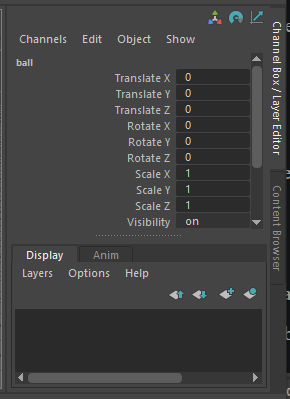

At the bottom of the screen is the **range slider**, this is where we change the settings for the animation

Above this is the **timeline**, this shows us which frame we are currently looking at and where we have set keyframes on the selected object.

Finally, we have the graph editor, this  shows how each keyframe transitions to the next.

We will use all these panels in the worksheet.

## Animation settings

We want the animation to run at 30 frames per second (FPS) and the total animation to be a 3 seconds long.

- On the **range slider** panel at the bottom of the screen change the FPS to **30 fps**.

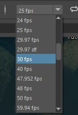

- To the left Change the number on the right to 90, this is the total number of frames in our animation ( 3 seconds @ 30fps)

- Move the slider to the far left, and change the right hand number to 60. This shows the range currently viewable in the timeline above (frame 1 - 60, which equates to 2 seconds of time).

- Lastly, click on the **time slider preferences** button in the bottom right to open the panel

- Change the playback speed to **30fps x 1** this will ensure the time line plays our animation at the correct speed when we press play.

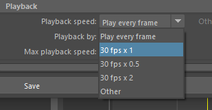

## Create a key frame

Now that we have set up the workspace we can start to animate.

- Click on the far left of the time slider to select the first frame.

- Select the ball and move it to 100 on the y axis. You can do this by using the move tool (w on the keyboard) or typing 100 in the channel box.

-To set a key frame, right click on **Translate y** in the channel box and select **Key selected**

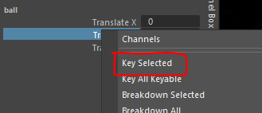

The property should turn red to indicate that it has a key frame, you should also see a red line on the timeline on frame 1.

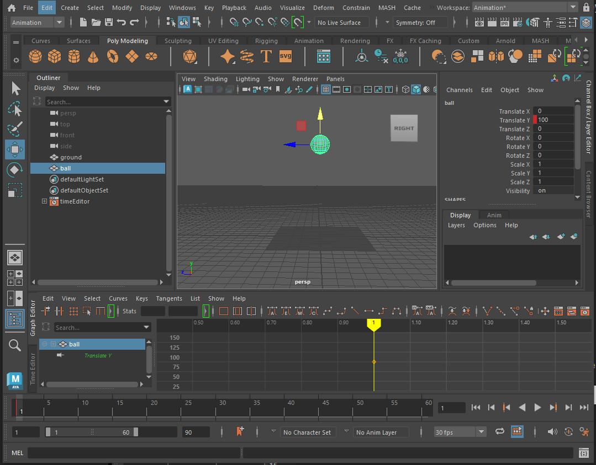

### Another keyframe

- Click on frame 15 on the time slider.

- Move the ball down so that it is just touching the ground, it may be helpful to go into the side view but it should be 10 as that is the radius of the ball.

- Keyframe the ball again by right clicking on the Translate Y property in the channel box and choosing **Key selected**.

You should now have 2 red lines on the time line indicating 2 keyframes.

### Set some more keyframes

You can now set the last few keyframes on your own, we want the ball to bounce twice, so set the following:

- at frame 30, set **translate y** to 90
- at frame 45, set **translate y** to 10
- at frame 60, set **translate y** to 80

## Play the animation

You can now play your animation by clicking on the play button to the right of the timeline (shortcut is **alt/option + v**)

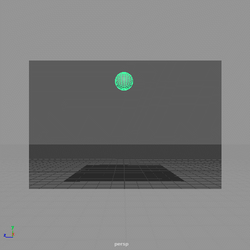

- Make sure yours looks like the animation above. If it does not, go back and try to work out where you went wrong or ask for help.

- Closely watch your animation, it should be going up and down but it doesn't really look like its bouncing. Why does it look wrong?

## Graph editor

With the ball selected, hover over the graph editor and press **f** on the keyboard so that the complete graph fills the panel.

The yellow diamonds show where you have set keyframes,  the green line shows where Maya has created a smooth transition between the keyframes.

To make the bounce more realistic we want to edit this  line to create a sharp change of direction on the bottom where it hits the floor and increase the curve on the top.

- Select the second keyframe on the graph editor so you can see the handles sticking out the side.

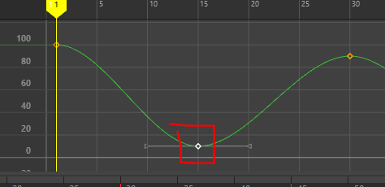

You can move the handles around to change the shape of the curve, but we want to move them around independently.

- **Right click** on keyframe and select **break keyframes**.

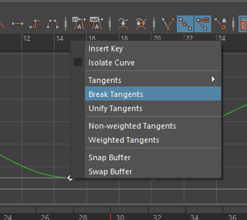

We can now move each handle independently but we also want to change the length so we have full control.

- Right click the keyframe again and choose **weighted tangents**

- Move the handles to create a v shape at the bottom of the bounce.

- You can now alter all the keyframes to create a sharp change in direction at the bottom of the bounce, and a gentle curve at the top.

play the animation again to see the result.

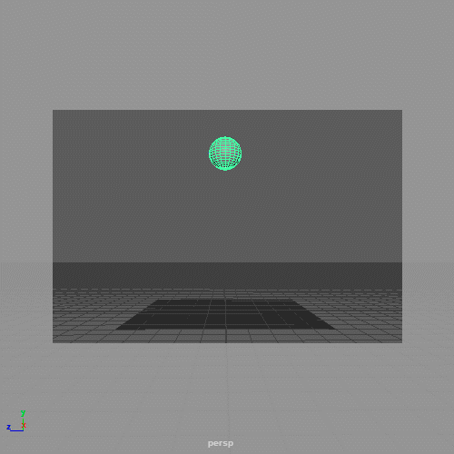

This looks much better, but there are still some things we can do to improve it.

## Squash and  Stretch

This is one of the most important principles in animation.

When an object moves or collides with something it will deform. 

If your object is made of a rubbery or flexible material it will deform more.

### Top of the bounce

firstly, we want the ball to stay spherical at the top of the bounce.

- Select frame 1, and keyframe Scale X, Scale Y and Scale Z at 1.

- Do the same thing on Frame 30 and 60.

### bottom of the bounce

We can now keyframe the squash when it hits the ground.

- Move to frame 15 and squash the ball vertically by reducing the Y Scale and keyframing.

To conserve the balls volume, this means we need to simultaneously stretch it horizontally.

- Increase the  Scale X and Scale Z and keyframe. I have used 1.3 and 0.7.

You should notice that the ball now doesn't hit the ground.

- Adjust and translate y so that the ball hits the floor at frame 15 and key it again.

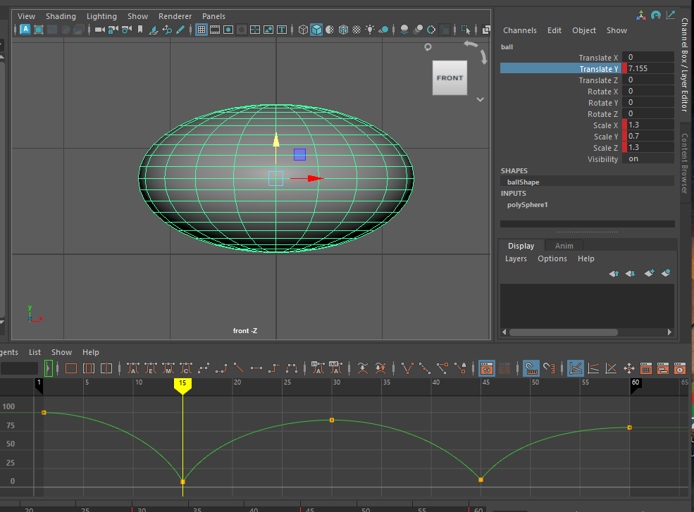

- Do the same for the second bounce at frame 45 and then look at your animation.

The ball now squashes but it looks Why does it look wrong now? How can we fix it?

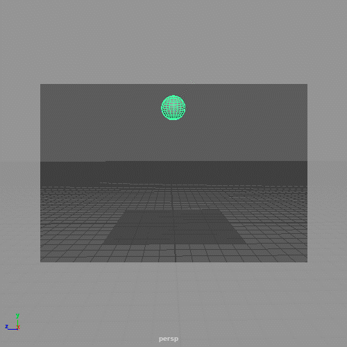

### Refine the animation

We have a similar issue as before, Maya is smoothing out the transition between keyframes so the ball starts to squash as it falls.

To fix this we need the ball to remain spherical until just before it hits the ground.

- On frame 14, just before the ball hits the ground, key the x, y and z scale of the ball to 1.

- Do the same thing on frame 44.

You also need to key frame the scale a few frames after the bounce so it returns to its original shape quicker. 

- Add a keyframe to frame 18 and 48, keying the balls x, y and z scale back to 1.

## Final animation

We now have a basic ball animation and you have covered all the basic skills of animating simple object in Maya.

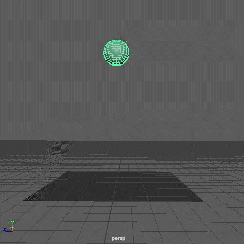

## Final challenge

- Add a keyframes to translate x or translate z to move it sideways as it bounces.

- Try changing the amount you squash and stretch the ball, can you make it look like its made of a harder material?

- What happens if you rotate the ball so that it spins as it move? consider how you may animate this in a different order next time to fix any issues.

