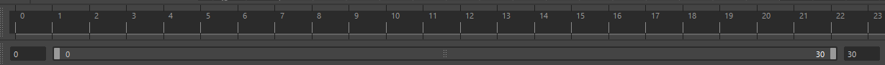

## Basic walk cycle

In this worksheet we will work through making a basic biped ( 2 legs) walk cycle.

### Open and Set up Maya

- Open Maya and create a blank scene.
- Save the scene somewhere sensible on your hard drive.
- Set up your scene in the Animation workspace
- Set the frames per second to 30 fps

- Set the total animation to be 30 frames long starting at 0 frames.

- In the time slider preferences, set the playback speed to **1 x 30fps**

### Import a rig

- Download the mega rig pack from blackboard.

For this worksheet we will be using **jack_rig.mb**

- Press **File > Import**

- Choose the jack rig and press import

## Walk cycle plan

Before we start animating we need to have a plan.

We will animate one step which we can then loop.

The character will be animated on the spot, allowing us to move them where we like later.

The animation will be one second in total, and consist of 2 steps, one for the right foot and one for the left.

We will start with the legs and hips, then move on to the arms.

### Main poses

We will create a walk cycle by first creating the four key poses.

1. front contact
2. first Passing
3. back contact
4. second passing

And then adding in the down and up pose for each leg

This image from Richard Williams book 
[The Animator's Survival Kit](https://en.wikipedia.org/wiki/The_Animator%27s_Survival_Kit)

It shows half of the complete cycle, we can just mirror it for the second leg.

### contact pose

First we are going to key in the first contact pose

- Select frame 0

- Select the root controller
- Move it down so the legs are bent, (if the body stretches when you move it down you have accidentally selected the hip controller, undo and try again)
- You can now press **s** on the keyboard to keyframe all the properties of the select controller.

- Move one of the feet backwards until the leg is straight, with this rig the heel will automatically rise.
- With the foot selected, press **s** to keyframe it.
- Move other leg forwards until it is straight and rotate it so the heel is on the floor.
- press **s** to keyframe.

- You can also raise the heel on the back foot a little more by selecting it in the channel box.

As this a looping animation we want the last frame to be the same as the first frame.

- keyframe both feet and the root controller on frame 30.

### Copy keyframes

We now want to create a middle contact pose, with the opposite leg forward.

- First keyframe the root controller on frame 15.

Now we want to copy the feet keyframes from frame 1 and put them on the opposite feet at frame 15.

- Select the back foot (the left leg)
- Select frame 0 in the timeline.
- Right click the timeline and select **copy**

- Select the front foot (the right leg)
- Select frame 15
- Right click the timeline and select **paste**

