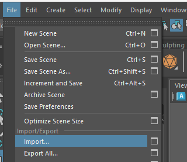

### Blend shapes

When rigging a character, a skeleton is added to to simulate the bones of a character. 

However, most facial movement are not controlled by a skeleton, for these we use blend shapes.

Createing blend shapes should be done **before** you create your skeleton.

## Import a character

- Open Maya and import the blue character from Blackboard.

