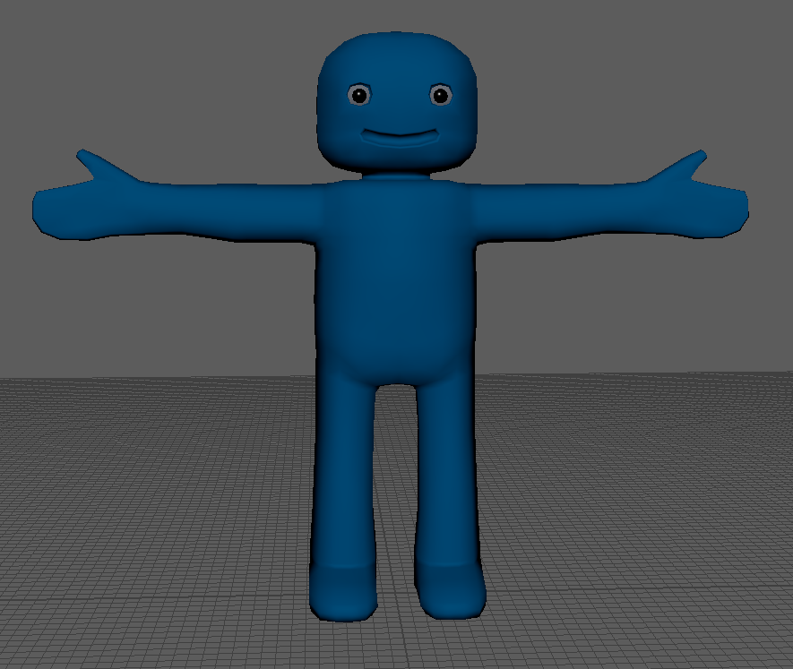
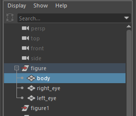
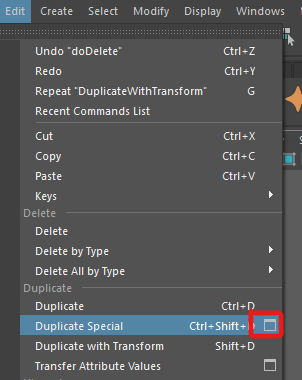
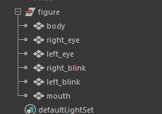
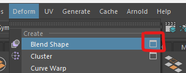
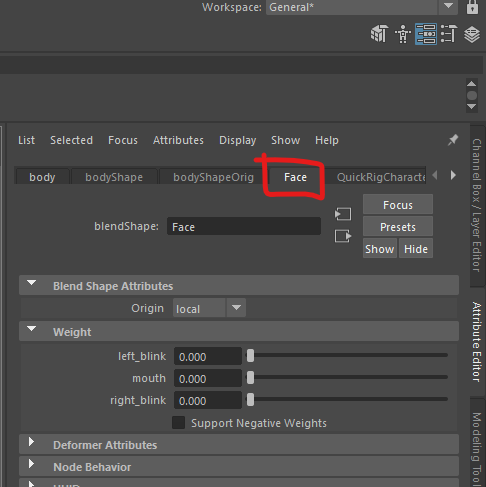

## Blend shapes

When rigging a character, a skeleton is added to to simulate the bones of a character. 

However, most facial movement are not controlled by a skeleton, for these we use blend shapes.

Creating blend shapes should be done **before** you create your skeleton.

### Create the blend shapes

#### Import a character

- Open Maya and import the blue character from Blackboard.

#### Duplicate the model

Select the entire character group

- In the top menu, select the option box next to **Edit > Duplicate Special**

- In the options, change Translate to 60 and the number of copies to 3

- Press apply and you should now have 4 blue Characters on the screen.

#### Rename the duplicated characters

We now need to rename the copies, the names we choose will be used to label the blend shapes we create.

- **Double click** on **body1** in the Outliner and rename it "right_blink"

- In the same way, rename **body2** to "left_blink" and
**body3** to "mouth"

#### Edit the meshes

We want to leave the original character as it is, but we can now edit the features on each body of all the duplicated meshes to match the new names.

- Select the **right_blink** character and edit the mesh to close the right eye.

- Do the same thing with the **left_blink** character.

- Finally, for the **mouth** character, alter the mouth in some way.

#### Create blend shapes

We can now use these 4 meshes to create our blend shapes.

- Hold down the **shift** key and select all 4 bodies. Make sure your select the original body **last**.

- With the bodies selected, in the top menu select the options button next to **Deform > Blend Shape** 

- Our new blend shapes will be grouped togeter, **BlendShape node** is where we put the name of the group, I choose "face"

- Tick **Delete targets**, this will remove the duplicate meshes, leaving us with only the original mesh.

- Press Apply

#### Test out your Blend shapes

If you select your original body mesh, you should now have a new tab in your attribute editor called **face**

You should see that there are 3 sliders called **left_blink**, **mouth** and **right_blink**

- Move the sliders to test out your blend shapes.

As these are now attributes you can keyframe them the same way as you keyFrame the controllers on your rig. 

### Create the controllers

We can just use the blend shapes as they are, but to work professionally we want to create controllers for these blend shapes so they can be easily accessed and animated.

To create the controllers follow the video bellow this worksheet in Blackboard.

