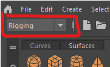
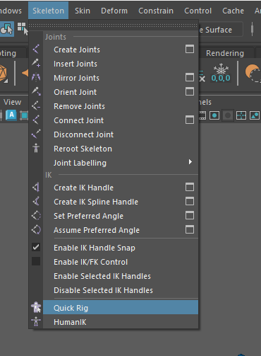

# Quick Rig

Previously we manually rigged a character, it is important to understand how a rig is constructed,  however, if you are rigging a simple biped Character there are a number of ways to generate a standard rig.

In Maya this is called **Quick rig** which we will be using for this tutorial.

This rig works well for animating in Maya, it will also work well in Unity.

## Blend Shapes

You don't require a character with blend shapes for this worksheet, however, It is important that if you want to add blend shapes, you do this **before** rigging your character.

## Open your character

If you completed the blend shape worksheet you should continue using that file, otherwise, download the original character from the top of this page on Blackboard.

## Create a new rig

- At the top left of the screen, change to the **Rigging** menu set.

- In the top menu, Select **Skeleton > Quick Rig**

This will open up the Quick Rig menu.

- Start by pressing the **+** icon at the top to create a new character.

- Now change the option box to **Step-BY-Step** as we want to have control over how the rig is created to get the best result.

We will go through the rigging process one step at a time. Each section has a rubbish bin icon which you can press to go back a step in case things don't work as well as expected.

### 1. Geometry

First we add the geometry

- Select the body mesh in the outliner and press the **+** symbol in section 1.

### 2. Guides

The guides show where the joints of the character will go.

- In section 2, feel free to  look at the guide settings, we will leave everything as it is and press **Create/Update**

### 3. Adjust the Guides

Maya does it best to position the guide circles where it things your joints should go, they are normally quite close,  however, it doesn't usually get it completely right.

Before you move on to section 4 you need to adjust the guides on one side and then mirror them over to the other side.

- Turn on wireframe (Shading > wireframe), this can help you find the knees and elbows.

- Start by moving the neck up slightly.

- next adjust the right wrist, elbow and shoulder into position. Be careful to place the elbow where the mesh has extra edges so it flexes correctly. Rotate the character around to check they are in the centre of each limb.

- Next, move onto the right hip, knee, ankle and toe. Place the guides where you think the joint in the bones would go. the knees should be positioned where the mesh has extra edges, and slightly forward of the hips and ankles to ensure the let bends in the correct direction.

Now that you have positioned all the joints on the right of the character, you can mirror them. Press the mirror key which you think represents what you want, if it goes wrong just undo and try again.

### 4. Skeleton

We can now generate the skeleton and control rig.

- Check you are happy with the Skeleton settings and then press **Create/Update**

Check that it looks correct, if it doesn't you can press the bin icon and adjust the guides and try again.

### 5. Skinning

The skeleton is now compleate so we just need to bind it to the mesh.

By defult, the **Binding Method** is set to **GVB** but we can press the cog icon and change the settings if we dont get a very good result.

- Press **Create/Update** in the skinning section.

Make sure you turn off wireframe mode (shading > smooth shade all) and test out your new rig.

- Move the foot controllers up to make sure the knees bend correctly, and move the hands to make sure the shoulder and elbows bend as expected.

If anything doesn't work as expected, you can delete the skinning by pressing the bin icon, and then press the cog icon to change the settings before binding again.

## Finishing off

You may notice that the eyes do not move with the head. 

You can fix this the same way as we did with the snowman rigging tutorial.

- Select the head controller and then **ctrl + click** one of the eyes. 

- In the top menu, go to **Constrain > Parent**

- Do the same thing with the other eye.

Now if you rotate the head controller, the eyes will stay in the head (mostly).

## Weight Painting

Although we have now rigged the Character, we have not quite finished. 

If you rotate the arm down to the body you may notice that the chest squashes in. You can also see this if you move the foot out to the side. The eyes will also bulge out of the head if you move it too far down.

We will fix this in the next worksheet on Weight painting

