## Rigging

In this worksheet we are going to cover the fundamental concepts of rigging a character. 

### Open Maya and set up workspace

- Open Maya and make a new scene
- In the top right of the screen, change the menu set to **Rigging**.

### Import the model.

- Import the snowman model from Blackboard by going to **File > Import**

### Create a Skeleton

- Enter the front view by tapping the space bar, hovering over the front view, and tapping space again.

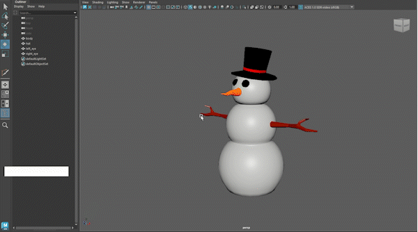

- Turn on X-ray joints and X-ray shader in the Shader panel menu item. 

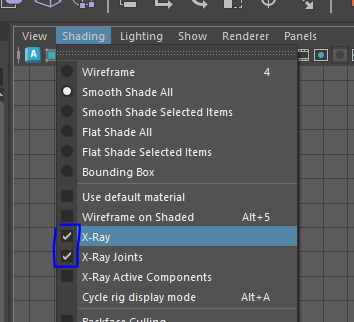

- Turn on **snap to projected center** on the top menu bar.

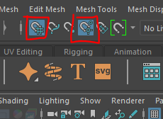

#### Adding spine joints

- Open the **Rigging** tab

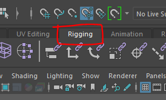

- Select the **Create Joint** button

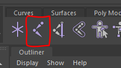

- Click on the centre of the bottom of the Snowman to add your first joint, this is the root joint.

- Click to add more joints at the waist, chest,neck and the top of the head.

- In the Outliner, open up all the joints by pressing the **+** symbol

- Rename all the joints by double clicking on them, this is really important and will help you later.

### Add arm joints

- Select *spine_2* in the outliner, and with the joint tool selected add joints to the right shoulder and hand.

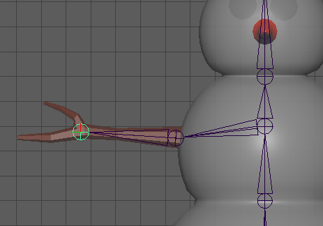

- rename the right shoulder joint and the right hand joint in the Outliner.
- The joint chain in your Outliner should now look like this:

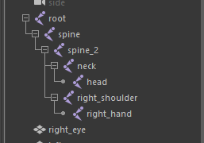

- Check yours carefully, if it doesn't look right you can move joints around in the outliner by **middle mouse clicking and dragging** on them.
- If you cannot fix it, you can just delete the bad joints and make them again.

#### Mirror the arm

- our model is symetrical so we can mirror the right arm across.
- Select **right_shoulder** in the outliner and select the option box next to **Skeleton > Mirror joints**

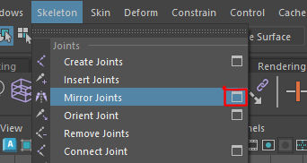

- Change the options to mirror across the **YZ** axis and replace **right_** with **left_** (assuming you named your joint correctly before)
- Press **apply** and you should have a left arm

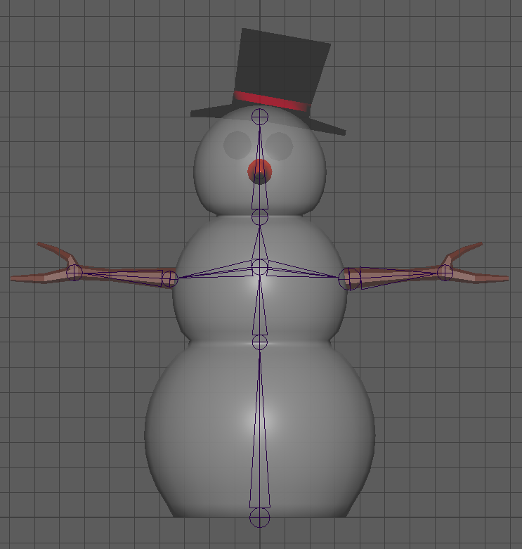

#### Check the perspective view

- Go back into the perspective view (HINT:tap the space bar)
- Turn on **x-ray** joints (HINT: shading > x-ray joints)
- Orbit around the snowman to check that all the joints look like they are in the centre of the snowman and its arms.

- If they are not you can select individual joints in the Outliner, and then press **w** to move them. This will move the entire joint chain, if you just want to move one joint press **d**

#### Tidy up skeleton

The last thing that is important to do is reset the rotation or all the joints.

- Select all the joints in the outliner by clicking the root and shift clicking the last one.

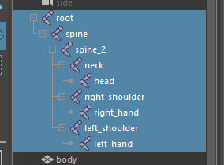

- In the top menu, choose **Modify > Freeze Transformations**

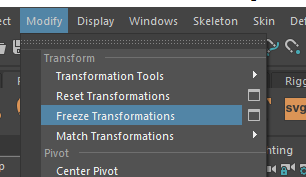 

- Select just the root controller and press the options button next to **Skeleton > Orient joints**

 
 
- Make sure your settings match these

- Press Apply.

### Add controllers

To make the skeleton easier to animate we add controllers. 

- Open the curves tab

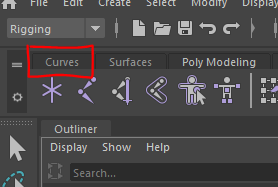

- Create a circle

- Scale the circle up so it is larger than the base of the snowman

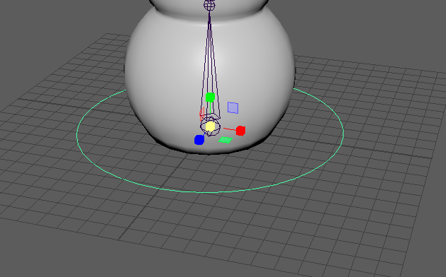

- Create 2 more circles, move and scale them so they sit around the waist joint and the neck joint.

- Create 2 more circles, rotate, scale and move them so they sit around the shoulder joints

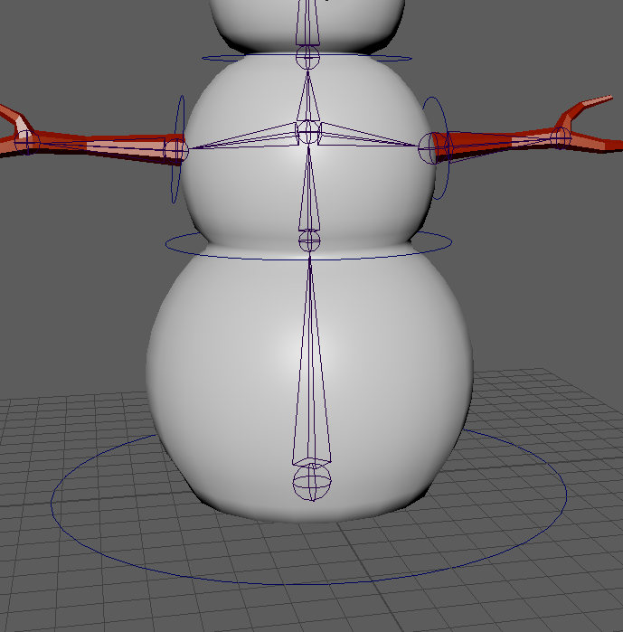

- Rename circles in the outliner

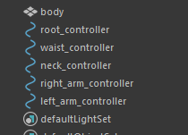

- Select all the circles and freeze the transformations by going to the top menu item **Modify > Freeze Transformations**

- Rearange the controllers by clicking and dragging with the middle mouse button parent them together correctly. This will ensure that when you move the waist or root controller, the nested controllers will move as well.

### Constrain the joints to the controllers

Now that we have all the joints and controllers created, we can bind them together so that the controllers control the joints.

#### Constrain the root.

We want the root controller to control position and rotation of the entire skeleton.

- In the outliner, select the root controllers and ctrl + click the root joint so both are selected ( it is important you do it in this order)

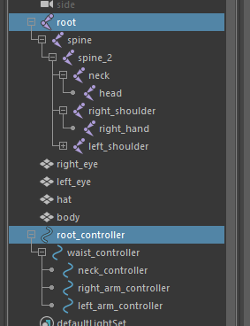

- Select the option box next to the top menu item **Constrain > Parent**

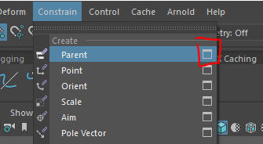

- Make sure the **Maintain offset** box is ticked

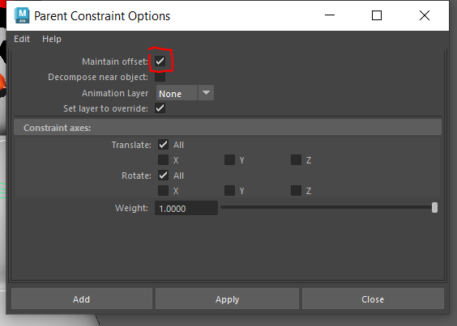

If you now move or rotate the root controller, the whole skeleton will move. If you try this make sure you reset the position back to its original position before you continue.

#### Constrain the orientation

For the other joints we are just going to use the controllers to control the orientation.

- Select the waist controller and the spine joint using ctrl + click.

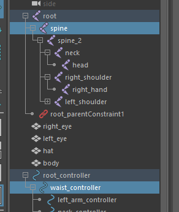

- Select the options box next to **Constrain > orient**

- Make sure the **Maintain offset** box is ticked

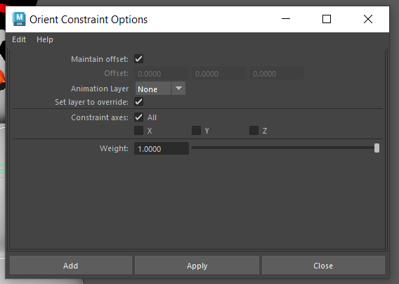

- Select **Apply**

Now you can do the same thing for the other 3 controllers. 

- Constrain the orientation of the left_arm_controller to the left shoulder joint, the right_arm_controller to the right shoulder joint and the neck controller to the neck joint.

You can now controll the entire skeleton by just using the controllers.

For this example we will just create these few, but I hope you can see that on a more complex skeleton we could create many more controller ( fingers, legs etc)

### Skinning

Now we get to the best bit, we attach the skeleton to the mesh in a proccess call **Skinning**

- Select the Body object and the root joint

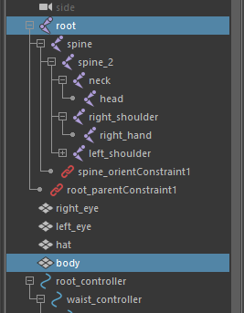

- In the top menu, select the options box for **Skin > Bind skin**

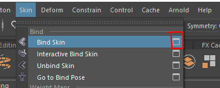

Depending on the shape of the character you are rigging, you may need to experiement with these options for the best result. but in our case we can leave them all as default and just change the Bind method.

- Change Bind method to **Heat Map**
- Press Apply

The skeleton will now be bound to the character.

- Rotate the waist and arm controllers to see how the character reacts.

### Eyes and Hat

You may have noticed that the hat and eyes don't stick to the head.

- Make sure the head is in the correct place.
- Select the hat and the eyes, then lasty also select the neck controller.

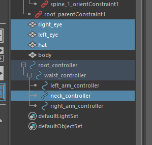

- press **p** on the keyboard to parent the hat and eyes to the controller.

You can now rotate the neck controller and the eyes and hat should stick to the head.

 

