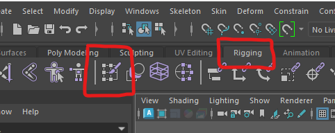
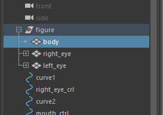
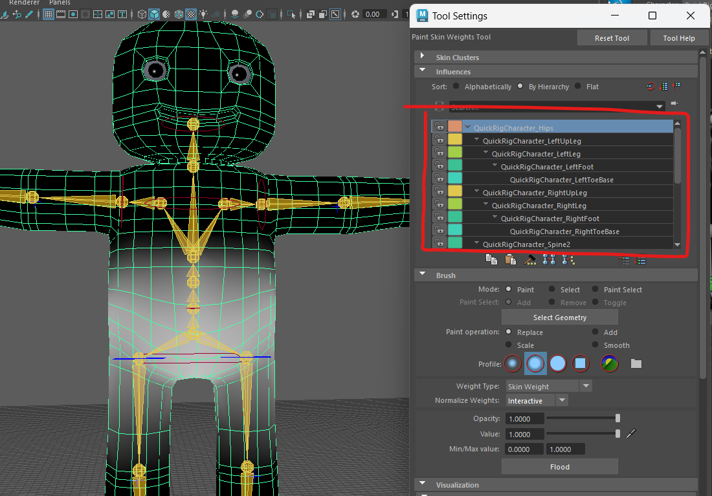

# Weight painting

This can be the most challenging part of rigging a character. But it is important to do if you want your character to behave properly.

## Why do I need to weight paint?

In the last worksheet we created a skeleton and bounded it to our character mesh in a process called skinning.

Each bone in the skeleton has influence over some of the veracities of our mesh. Maya distrubute this influence inteligently based on your preferences, but generally, the closer the vertex is to a joint, the more influence it has.

You can see this under the arms, where the closest joint is the shoulder, when you rotate the shoulder the mesh under the arm moves.

You can also see it on the head, if you rotate the head forward the chest moves and the eyes shift in their sockets. 

Weight painting is the process of re-distributing this influence. In this case, we want to move the influence on the mesh under the arms from the sholder joint to one of the spine joint and all the influence on the head should be with the head joint.

## Start Weight Painting

### Open the Weight painting tools

- Open the Rigging tab along the top and select **Paint Skin Weights**

- Select the body mesh.

### Tour of weight painting tools

The box at the top lets you select the different joints in your skeleton, When you select a joint the you can see the influence it has on the mesh.

